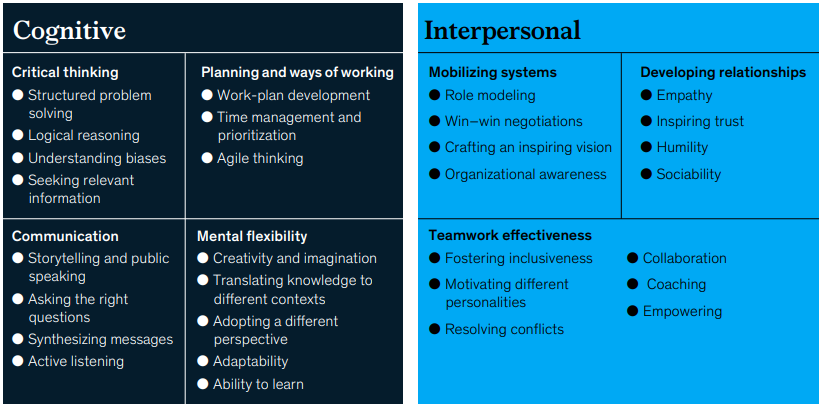
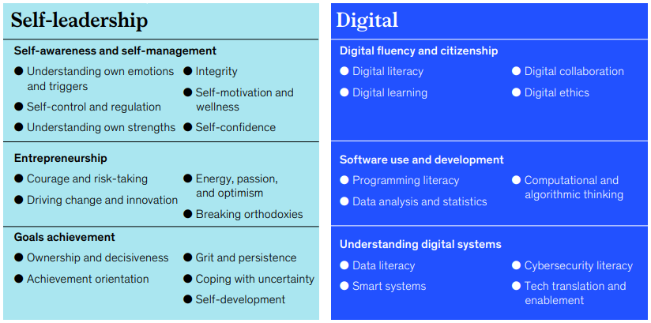
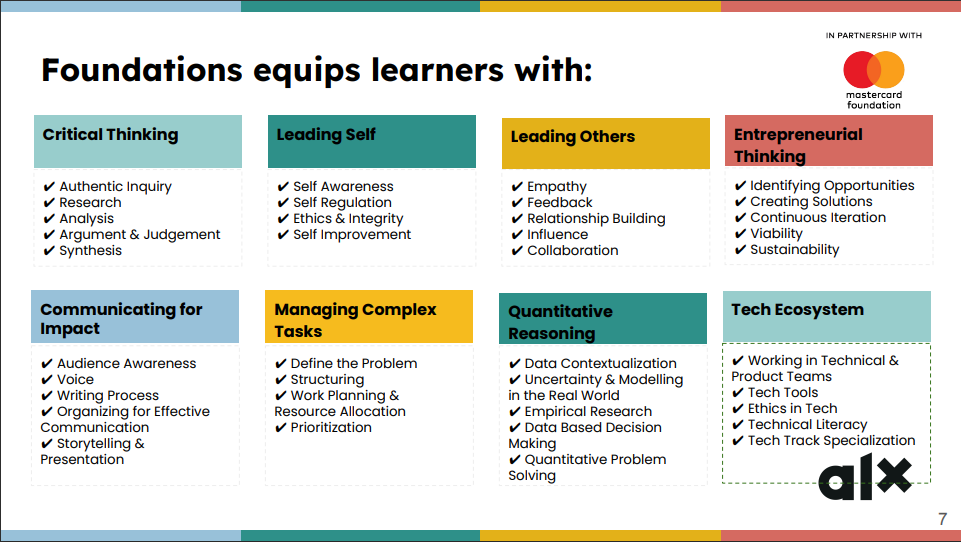

# Module 1.1 - Getting Started Notes

- [FOMO](https://www.merriam-webster.com/dictionary/FOMO): Fear of missing out
- Number of hours required per week: 30 - 40 hours. Below is the break down

| Percentage | Total Hours (30 - 40) | Usage |
|:----------:|:-----------:|:-----:|
| 45% | 13.5  - 18| Working on Canvas (the Learning platform) |
| 30% |  9 - 12   | Working on assignments |
| 15% | 4.5  - 6 | Working with peers at City Hubs |
| 10% |  3  - 4 | Applying the knowledge in your local community |

## Why take the ALX Foundation program?

- It equips you with the ability to
  - think critically and creatively to solve complex problems
  - skillfully communicate in both writing and speaking
  - manage your time wisely
  - collaborate with diverse team members to successfully complete projects.

## Nuggets from [research article by McKinsey](https://mck.co/3NRmOkY)

- The need for manual and physical skills, as well as basic [cognitive](https://bit.ly/3HSuEqY) ones, will decline
- Demand for technological, social and emotional, and higher [cognitive](https://bit.ly/3HSuEqY) skills will grow.
- It is difficult to teach what is not well defined.
- Foundation skills that will benefit anyone regardless of occupation, requires them to
have the ability to:
  - add value beyond what can be done by automated systems and intelligent machines
  - operate in a digital environment
  - continually adapt to new ways of working and new occupations
- 56 foundational skills were identified through the research
  - generally referred to as **DELTAS**, because they are a mix of skills and attitudes

## The 8 Meta Skills

- **Critical Thinking**
  - Examine facts and consider solutions
- **Leading Self**
  - Develope self-awareness and personal values
- **Leading Others**
  - Build strong relationships with teammates. Network!
- **Entrepreneurial Thinking**
  - See opportunities and seize them creatively
- **Communicating for Impact**
  - Know the audience and share with confidence
- **Managing Complex Tasks**
  - Create an action plan to tackle complex tasks.
  - Involves time management
  - Ability to research for solutions
  - Delegating when necessary
- **Quantitative Reasoning**
  - Evaluate data and make decisions
  - [Empirical Research](https://guides.libraries.psu.edu/emp)
  - Data-based decision making
  - Forecast -> Look into the future
  - Power BI is a tool that helps to easily visualize data
- **Tech Ecosystem**
  - Leverage tools to be more efficient and effective
  - ChatGPT is great AI tool that you can leverage to answer questions with some guidance.

