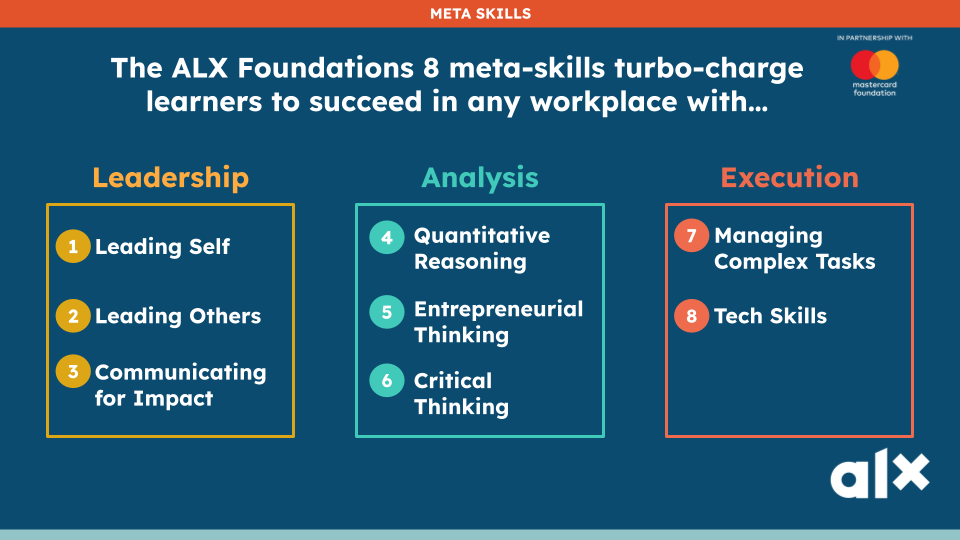

# Module 1.3 - Intro to ALX, The Room and The Room Fellowship

## ALX Mission

**To develop three million ethical entrepreneurial leaders,**
**who can create transformational impact on the continent**

## ALX Values (The CHAIR Values)

- Courage
- Humility
- Adventure
- Initiative
- Resilience

## The ROOM

- Launched in 2019
- A space where the community networks and shares values.
- Another organization in the AL Group
- A community of world-class tech talent that will power the future

### What it Provides

- Access to a diverse network
  - leads to new ideas, collaborations and opportunities
- Industry insights and trends
- Career growth
- Learning opportunities
- Cultural awareness and diversity

### The ROOM's Vision

#### **_"Our mission is to catalyze global change by connecting the world's doers with extraordinary opportunities"_**

### The Mantra

#### **_"Relationships, not transactions"._**

- Relationships take time to build
- Trust is the most valuable currency
- Built over decades, not hours.

### The ROOM Values

- Be a Pathfinder
  - If we all give, we all get.
- Be Trustworthy
  - Deliver on what you say you will do
- Show Respect
  - regardless of background
- No Ego
  - Give others the space to contribute
- Be a Doer, not a Talker
  - Be a **GYSHIDO** person, less talking
  - GYSHIDO -> Get Your Shit Done.

## The ROOM Fellowship

A community committed to JOBS and dignity

- Connect
- Learn
- Elevate

## Mastercard Foundation Partnership

### Young Africa Works

- Building economic opportunities for young people in Africa
- JOBS are the goal
- Use a demand-led approach
- Program fees are waived
- Reporting progress helps to receive more support in the future
  - as well gauge progress of the ALX journey

## The 8 Meta Skills - Grouped

Here's the 8 Meta Skills Grouped

Now here's a breakdown of each Skill.

Check out a [previous](1.1-getting-started.md#the-8-meta-skills) module for more info on the Meta skills.
