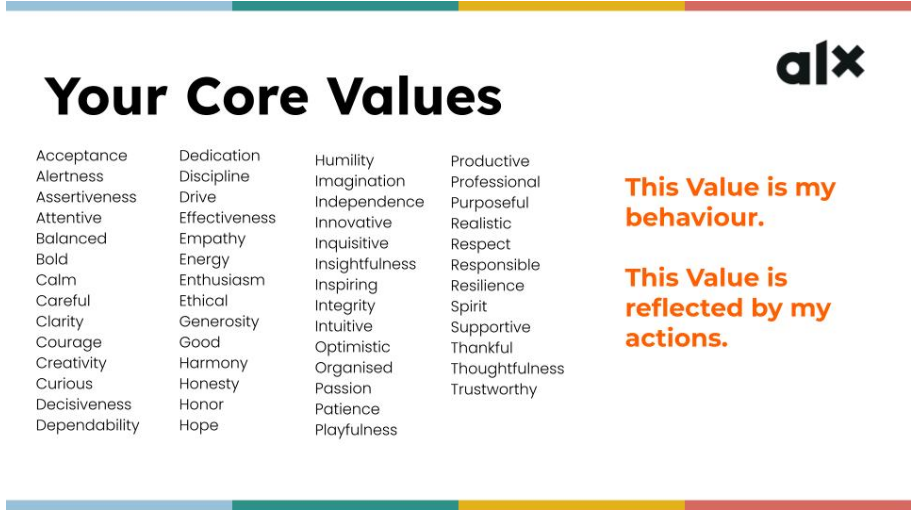
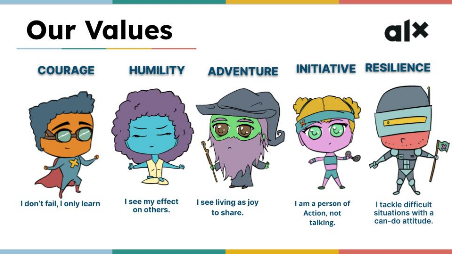
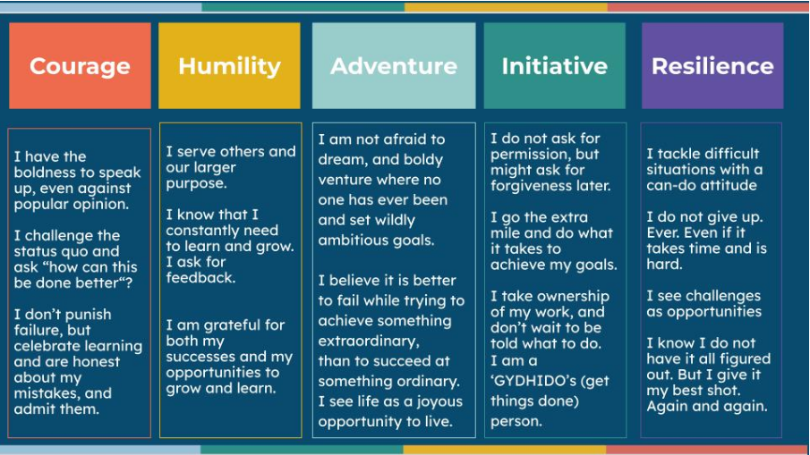

# Module 1.7 - Karibu Lesson on Core Values

## List of Personal Values

These are values you discovered as part of a success or something you are usually identified with.

Your personal values help you to stay motivated even when the going gets tough. Your ability to be resilient and curious about how and why things work they way they do gets you to dig deeper and spend more time figuring out solutions to complex problems.

Thinking critically about your next steps and their impacts based on facts allows to be sure of the outcome of your actions. Sure, there will be times where you just have to trust your grit and get something done. Sometimes, it doesn't even have to make sense in the beginning.

All these are possible when you are in sync with your Self.

## ALX CHAIR Values

The CHAIR values, is a great baseline and an amazing guide to follow or add to your existing values if you haven't already.

Taking it literally, the CHAIR *(as in an object: chair)* values **gives you the right posture** as you navigate through the course and even in real life. The values shared helps anyone believe in the concept that *failure is normal*, and that it will happen. But it doesn't end there, you learned something from that experience. So it is time to gather up all the **Courage** you can and get back at it.

*You don't fail, you only learned a new way that didn't work. That's experience!*

Your willingness to accept feedback and give feedback shows your interest in learning and growing as an individual. You possess the quality of a **humble** fellow whose **humility** is felt by others and has a positive impact in their lives, as well as yours.

It takes a curious person to dig deeper into the unknown. The willingness to figure out the bolts and nuts of a moving piece is such an **adventure** to embark on. And the results? Mostly fulfilling.

You won't walk if you don't take a step. Nothing happens without motion. Take the **initiative**, draft some plans, and oh, here's a tip you'd want to keep in mind while setting that goal or plan.

*Pick something (as radical as possible) that will keep you motivated to work, not something that will make you want to quit!*

Without his stamina, Atlas wouldn't have been heard mentioned. Your **resilience** to keep moving even in the face of troubles is what will keep you in the *game*. If you give in to fears and setbacks, you will live with lots of regrets of *what could have been*. You surely don't want this to be your story. Do you?

