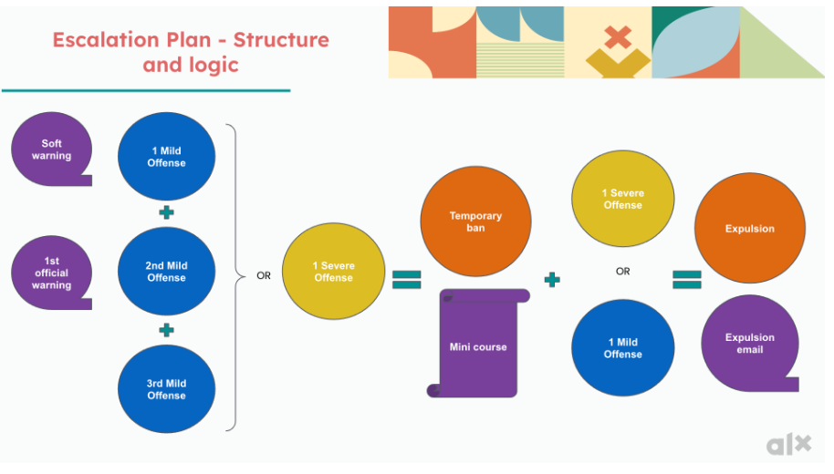

# Module 1.8 - Community Guidelines and Code of Conduct

## Community Values

1. Respect and kindness
2. Confidentiality
3. Inclusivity
4. Accountability
5. Keeping it relevant
6. Active participation
7. Commitment to learning
8. Constructive feedback
9. Flexibility
10. Continuous improvement

## Code of Conduct

- Practice the [CHAIR Values](1.7-karibu-core-values.md#alx-chair-values) and Community Values to the best of your ability
- Refrain from
  - Harassment
    - types
      - verbally
      - physically
      - power abuse
      - psychological
      - cyberbulling
      - retaliation - taking revenge
      - sexual
  - Cheating
    - obtaining credit for work in a dishonest or deceptive manner
  - Discrimination
  - Plagiarism
    - presenting someone's work or ideas as your own.
  - Any other harmful or unethical behavior

## Offense Types

### Misuse

- identifying as something other than a student or Fellow in the name of representing ALX.

### Mild Offense

- activities that disturb the smooth running of the program
- use of abusive language
- failure to comply with regulations concerning the use of the organization's logo, and branding for goals outside the interest of ALX.

### Severe

- Just about everything in [Code of Conduct](#code-of-conduct)
- Damage to physical integrity of the City Hub

## Breach Consequence

Repercussion associated with breaching the code of conduct.

