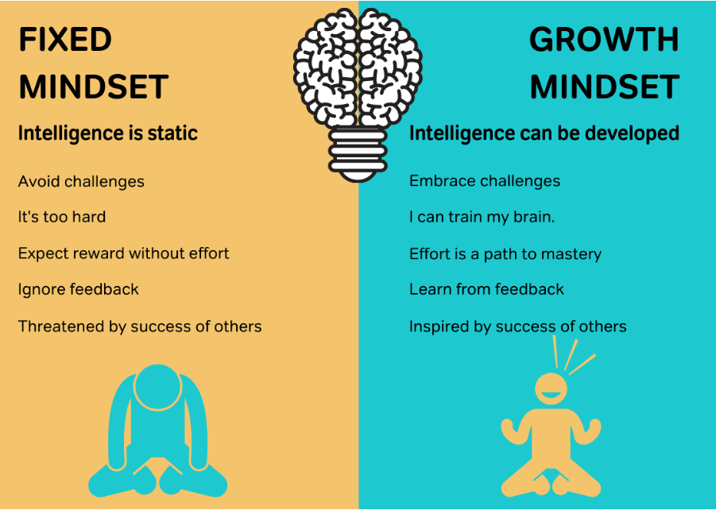

# Module 2.10 - Mindset

## Growth Mindset - The Concept of The Power of Yet

Holding a belief that one's intelligence and abilities can grow through dedication and hard work.

1. What is growth mindset?
   - it's a mind that's willing to embrace challenges and work through them
   - it's the belief that ones abilities could be developed with effort and time
   - sees failure as an opportunity to do better
2. What is fixed mindset?
   - limited intelligence
   - unwillingness to try new challenges when they prove to be harder than what is usually known
   - thinks about now and not about what could possibly come out of their efforts if they tried.
   - indulges in dubious way to get work done.
3. How do brains behave when they are in fixed vs. growth mindset?
   - fixed mindsets
     - run from the difficulty
     - they'd rather cheat than study
     - finds someone worse so they feel good about themselves
     - Brains in growth mindset show no activity when confronted with an error.
   - growth mindsets
     - embrace the difficulty
     - learns and engages with the problem
     - process the error and corrects it
     - Brains in growth mindset show a lot of activity when confronted with an error.
4. What evidence is there that growth mindset is important?
   - willingness to learn if failure is encountered
   - there's improvement over time
   - In a study with a math computer game, students who were rewarded for process gave more effort and used more strategies than students who were rewarded for correct answers.
   - In one study, one group of students were taught that their brains develop new neuronal connections and grow when they learn new things. Another group were not taught this lesson. The students who were taught the brain lesson performed better than the students who were not taught the lesson.

### Building the Bridge to Yet

- Praise the effort, perseverance, process, focus, improvement and strategies
  - not just talent and intelligence.
- Reward Yet
  - use the Praising Yet method

## Grit - Perseverance in the face of challenges

Grit is the **passion** and **tenacity** towards **long-term**, worthwhile goals. It is the **capacity** to stick with something and **show perseverance** in the face of challenges. Being naturally intelligent and skilled is wonderful, but to really succeed and thrive, we need the capacity for perseverance.

### Note on Grit from TED Talk

Link: <https://youtu.be/H14bBuluwB8>

- Life is a marathon, not a sprint
- Talent doesn't make you gritty
- Grit is not directly to any measure of talent, it's simply your ability to thrive
- Works well with Growth Mindset.
- Willingness to persevere even when you fail
- Failure should be embrace and nurtured for better results on next iteration
