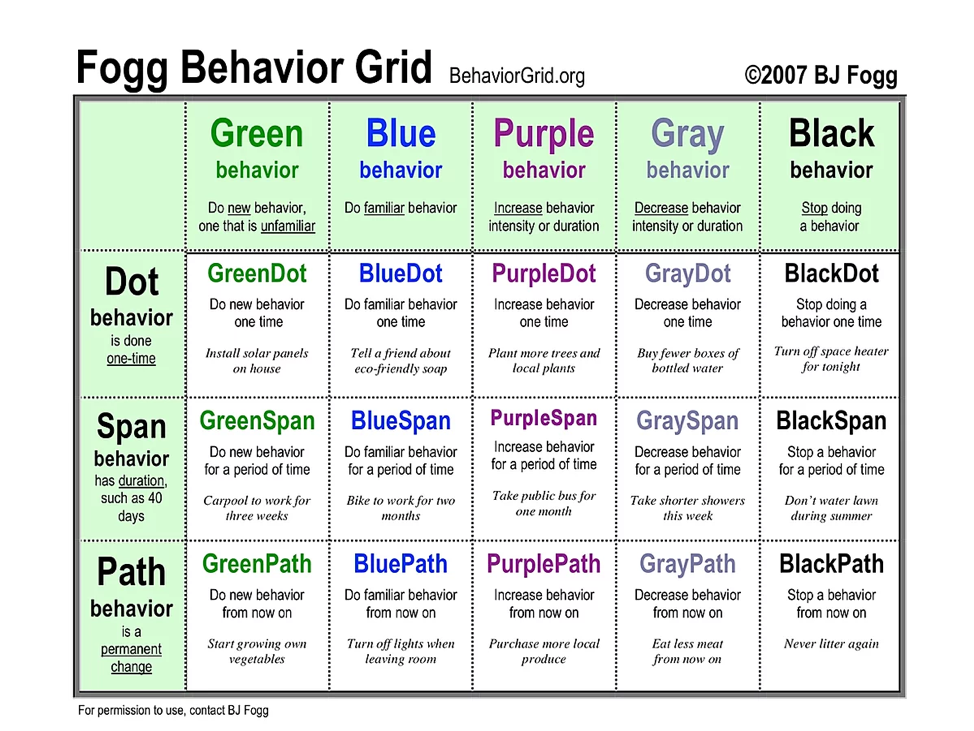
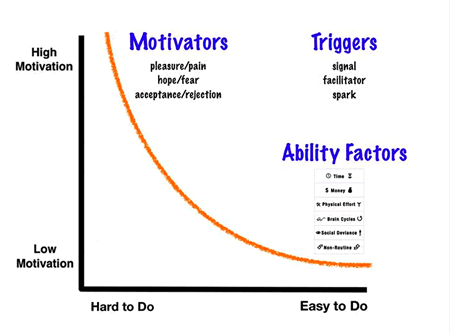

# Module 2.11 - Self Regulation

> *"Self-regulation is the ability to monitor and control our own behaviour, emotions, or thoughts, altering them in accordance with the demands of the situation"* - Education.com

 

> *"Simply being “self-aware” isn’t enough if you’re looking to make lasting changes and positive impacts both on yourself and on those around you."*[[1]](<https://bit.ly/3WvX8wV> "Congratulations, You're Self-Aware: Now What?") - Frances McIntosh

## The Difference between Self-Awareness and Self-Regulation

- Self-awareness is when you understand the impact of your behavior on others.
- Self-regulation is being *aware* of this impact and making adjustments to your behavior, often for the betterment of a situation.[[1]](<https://bit.ly/3WvX8wV> "Congratulations, You're Self-Aware: Now What?")

So basically, self-regulation is knowing your potential and trigger points, and keeping them in check. Capitalizing only on self-awareness and leaving the self-regulation part of the equation only reduces you to a narcissistic individual. Such person believes everything should be about them.

As a leader, you should always work for the "greater good".[[1]](<https://bit.ly/3WvX8wV> "Congratulations, You're Self-Aware: Now What?")

## Why Leaders Need to Self-Regulate

A leader strong in both self-awareness and self-regulation can:

- Motivate more easily
- Increase teamwork and productivity
- See the ripple effect - open to feedback
  - this is exactly what self-awareness and self-regulation are: a demonstration of how to powerfully grow.

## How to Increase Your Self-Awareness and Self-Regulation

- **Conduct a 360 Leadership Assessment**
    *It highlights your leadership capabilities and identifies areas for development*
  - know your strengths and weaknesses
  - focus on areas you need to grow and work on
  - when you "screw up", learn from it and don't have that same "screw up" again.
  - acknowledge what you did well and note areas where you could have improved
- **Ask your team**
- **Listen to feedback from your team**
  - accept feedback and work accordingly where necessary
- **Look at yourself objectively**
  - recognize and admit your errors and mistakes
  - set up systems for making the change in the future.
- **Be curious**
  - be interested in why people behave the way they do and how your behavior impacts them
  - make conscious efforts to adjust your methods where necessary to better suit those you are leading.
    - by no means are you to compromise on your core values though.

> Self-regulation helps you to become more effective.

## The RULER Method

- **Recognize**: What is your current state at the moment?
- **Understand**: What triggered this? Why might I be feeling this way?
- **Label**: What would you call this feeling you are experiencing?
- **Express**: How would you explain what just happened to someone else to ask for help or - simply to share?
- **Regulate**: What might you be able to do to help you manage this feeling/emotion?

## The Science Behind Self-Improvement[[2]](<https://youtu.be/AdKUJxjn-R8>)

> *“Habit becomes personality and personality becomes character, and character becomes you.”* - Chade-Meng Tan

 

> Plant a tiny seed in the right spot and it will grow without coaxing.

### What causes behavior change?

**B** = **mat**

- Motivation: Allows you to do hard things
- Ability
- Trigger (The action)

### Fogg's format for Tiny Habits

> “After I.........*(existing habit)*, I will.........*(new habit)*"

### Sources

[1]: Congratulations, You're Self-Aware: Now What? - France McIntosh (<https://bit.ly/3WvX8wV>)
[2]: Forget big change, start with a Tiny habit: BJ Fogg (<https://youtu.be/AdKUJxjn-R8>)
