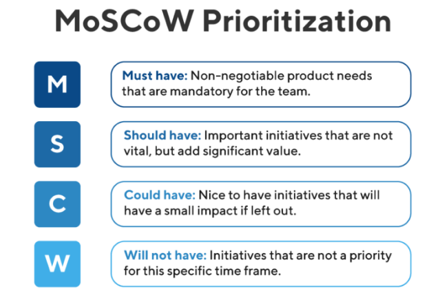
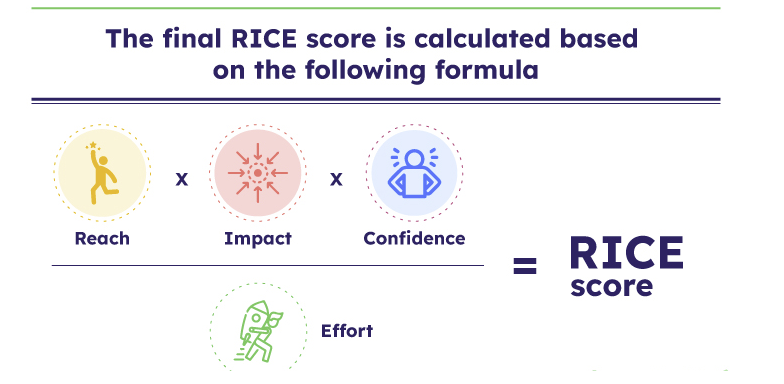
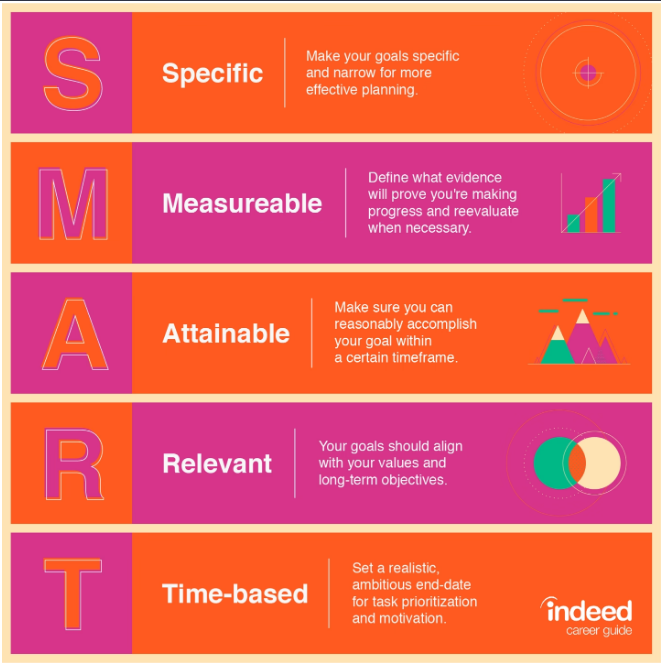

# Module 2.12 - Time Management and Goal Setting

**Time management is simply the process of organizing and planning how to divide your time between activities.** The goal is to optimize your time, so you can get the most important things done in the most effective way.

## Time Management Fun facts

- Less than 1 in 5 people (18%) have a proper time management system.

- 82% of people don’t have a time management system. They just use a list or their email inbox.

- The Eisenhower matrix (also known as the prioritization matrix) is the most successful time management technique. (There are other techniques out there. Feel free to search them up if you are feeling curious)

- 100% of people using this technique feel their work is under control either 4 or 5 days per week.

- The least successful time management technique is ‘dealing with whatever comes up’.

- 28% of people using this technique feel their work is never or very rarely (1 day per week) under control.

- 1 in 8 people (12.5%) never feel in control at work.

- Only 20% ( 1 in 5) people carry out a monthly time audit to review how they are spending their time.

- 49% of people have never carried out a time audit (yet it is our most precious resource).

## How to manage time

- allocate adequate time
- decide on the order of completion
  - prioritize the importance of each task
- use the time wisely

## The MoSCoW Prioritization

- **Must have**: essential features that must be included in the next release
- **Should have**: features that are important but not critical
- **Could have**: features that would be nice to have but are not essential
- **Won't have**: features that are out of scope or not feasible

## The RICE Framework

- A roadmap prioritization framework
- helps teams to objectively evaluate the importance of their initiatives
- Designed to score items according to four factors
  - **Reach**
    - The number of people who will see the campaign
    - based on data
    - estimated audience impacted
  - **Impact**
    - The degree to which the campaign will impact sales
      - 3 = massive impact
      - 2 = high impact
      - 1 = medium impact
      - .5 = low impact
      - .25 = minimal impact
  - **Confidence**
    - How certain you are that the campaign will be successful
      - 100% = high confidence
      - 80% = medium confidence
      - 50% = low confidence
        - consider it as "moonshot" and assume priorities need to be elsewhere
  - **Effort** (the denominator)
    - the cost involved
    - The amount of time and resources required to execute the campaign

  

## How teams should operate

1. Focus on Value
2. Use Feedback (user story)
3. Break work into small pieces (backlogs)
   - use **sprints** to tackle user stories
4. Collaborate

## S.M.A.R.T Goals

A goal is a <u>distinct or defined outcome</u> that is expected from the assignment or project.

