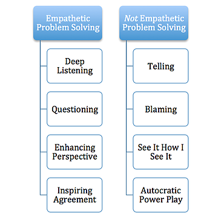
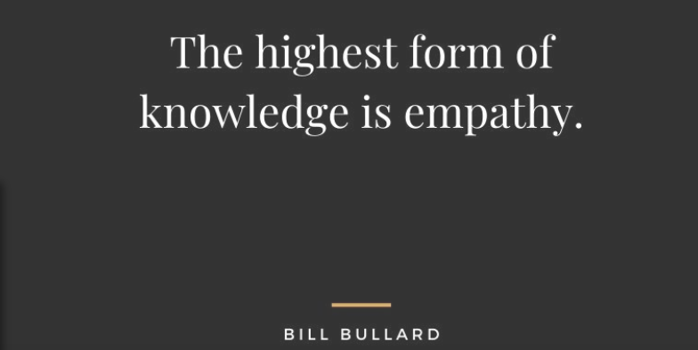
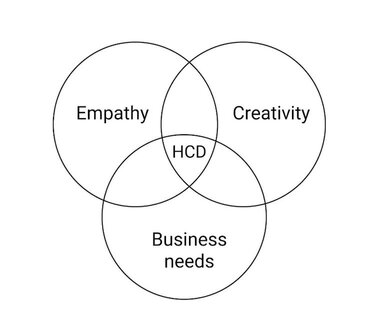

# Module 2.15 - Secret Sauce: Part 2

> *Love and compassion are necessities. They are not luxuries. Without them, humanity cannot survive* - Dalai Lama

## Notes on Empathy

What makes something better is connection

- Empathy is different from sympathy
  - empathy **feels** connection
  - sympathy **drives** disconnection
- Empathy is feeling with people
- Empathy is a choice, and a vulnerable one
- the most recognized dimension of emotional intelligence
- Responses don't always show affection

### The Importance of Empathy

Empathy is essential for leadership for at least these reasons:

- The increasing use of **teams**
  - without understanding, teams will collapse and businesses will fall
  - understanding each other and raising constructive complaints helps
  - be open to listen what bothers team members and figure a way out
- The rapid pace of **globalization**
  - working with diverse people requires diversity in how matters are handled
  - having a deep understanding of both the existence and the importance of cultural and ethnic differences
- The growing need to retain talent
  - continuous mentoring and coaching
  - building long lasting relationships, not transactions

### Three Kinds of Empathy

- **Cognitive empathy (perspective-taking)**
  - can help in a negotiation or motivating people
  - not enough in times of crisis
  - could be mastered by bad actors who form the "Dark Triad", yet with no sympathy
    - narcissists
    - Machiavellians
    - sociopaths
- **Emotional empathy**
  - you feel physically along with the other person, as though their emotions were contagious
  - makes someone well-attuned to another person's inner emotional world
  - downsides
    - when people lack the ability to manage their own distressing emotions
    - can lead to burnout
- **Compassionate empathy (empathetic concern)**
  - not just...
    - concerned with understanding how people feel, or
    - feeling it with them
  - it is about taking the necessary action, if needed, to help them.
  - it could also mean that being the stronger person and showing what to do next
    - you may not necessarily need to cry with them.
    - you have to help with the "what happens next" thoughts.
    - all these are forms of helping, while being empathetic

### How to grow empathy

- **Be observant of others**
  - it's not always about you
  - cause yourself to genuinely care about how they feel
  - first step to expanding your empathy
- **Use active listening**
  - listen first
  - ask follow up questions
  - you don't need to share someone's opinion in order to understand it
    - be careful though
  - helps inform and expand your own opinion
- **Open up**
  - empathy is a two way street

## Empathy for Problem Solving

> "Empathetic problem solving is the ability to really understand and feel another’s perspective in a conflict or issue. Empathetic problem-solving is about what you do in **communication** while **solving** a problem but also about <u>what you don’t do.</u>"[1]

- it requires stamina and mindfulness from a leader
- it can gain us the respect and trust our people.

### Empathetic Problem Solving

- Deep listening is a way of listening where we are fully present without trying to immediately control or judge a situation.[1]

- Questioning is about asking questions to understand what happened so that you can arrive at a workable solution.[1]
  - the other side is to blame, which you have to do here.
  - questions should be neutral and without judgement
  - <blockquote>Real questioning should be about revealing obstacles and uncovering alternate paths ahead[1]</blockquote>

- Enhancing perspective is akin to ‘see it how I see it’ but more subtle and done together rather than delivered straightaway.[1]

- Inspiring someone to make the choice you want is always better than an autocratic power play.

## Significance of Empathy in Technology Teams

It helps build meaningful connections with colleagues and users

1. **Human centered Design (HCD)**
   - a.k.a user centered design
   - the process of designing technology solutions that meet the needs and expectations of users
2. **Collaboration**
   - listening to perspective and feedback
   - the end result is building trust and creating a supportive community that values diverse voices.
3. **Ethics and integrity**
   - ensure user data is securely stored and only accessible to authorized personnel only
4. **User feedback**
   - continuously improve on the quality of the solution, using the user's experience and future requests.

   

## Sources

[1]: Chris Stathakis: The Art of Empathetic Problem Solving <https://www.stathakis.com/blog/leadership/the-art-of-empathetic-problem-solving>
