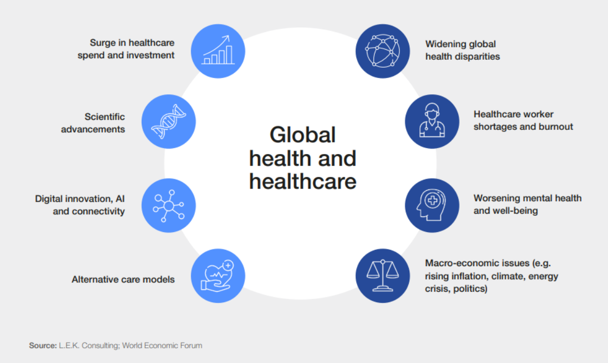
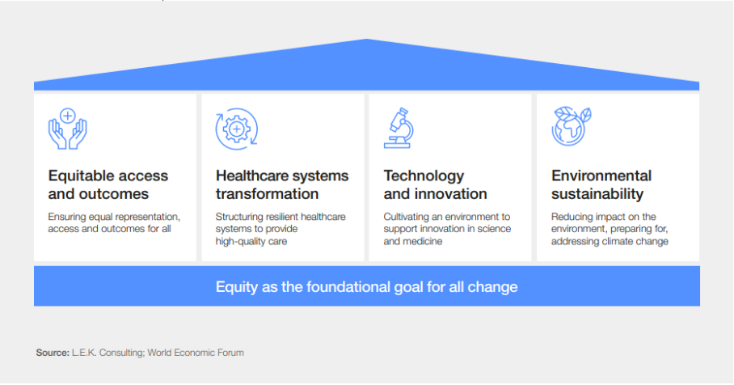

# Module 2.16 - Purpose: Part 3

## Global Opportunity: Job Creation

- According to the UN, 600 million people will be looking for jobs over the next decade
- Technology, Healthcare, and Hospitality sectors are expected to create millions of jobs by 2030

## Global Challenge: Healthcare

According to World Economic Forum, there are 8 Health trends to watch for in 2023, one of which is mental health and well-being

## The challenges faced by the global health and healthcare sector

- **Near-term**
  - macroeconomic instability
  - climate change-related challenges
  - healthcare workforce shortages
  - worsening mental health
  - supply chain issues

- **Longer-term**
  - growing demand for services
  - an increasing funding gap
  - a lack of incentives for innovation
  - widening disparities in overall health and wellness
  - and variable access to advanced therapies

### 8 trends shaping global healthcare[1]

1. **Surging healthcare spend and investment**
   - global healthcare spend has grown more than 40% between 2018 and 2022
   - reaching $12 trillion
   - healthcare investments have been high in recent years as well
   - has a focus on areas such as:
     - gene immunotherapy
     - new [mRNA](<#8-trends-shaping-global-healthcare1> "messenger RNA") vaccines for diseases such as Zika and malaria.
2. **Scientific advancements**
   - progress in treatments and diagnosis of disease.
   - advancements in liquid biopsies
     - e.g., are changing how cancer is detected.
   - Precision medicine using biomarkers is increasingly being used
3. **Digital innovation and AI**
   - the growing attention being paid to data
   - AI is being used to support areas including
     - diagnosis
     - clinical decisions
     - monitoring and treatment
     - workflow.
4. **Alternative care models**
   - growth in expenditure on health provision and care at home is expected to outpace healthcare spend in nearly all other areas.
   - investment will be used to further home diagnostics, home-administered drug delivery systems and patient monitoring devices
5. **Widening inequalities**
   - Future healthcare provision needs to focus on making healthcare affordable and accessible to all.
6. **Healthcare worker shortages and burnout**
   - There's a need for more healthcare workers
7. **Worsening mental health and well-being**
8. **Macro-economic issues**
   - issues that create increasing costs and friction for the healthcare system
     - Geopolitical tensions,
     - soaring energy prices,
     - inflation and supply chain

## Global Opportunity: Wildlife Conservation

Wildlife refers to all non-domesticated plants, animals, and other organisms living in their natural habitats.

> More than 40 000 species are threatened with extinction. - International Institute of Sustainable Development (IISD)

### The Negative Effects of Natural World Destructure on Human Health

- Increased exposure to disease
- Worsened air and water quality
- Decreased food production
- Deepened impact of extreme weather events
- Weakened ability to combat climate change
- Decreased well-being

## Sources

[1]: World Health Day: 8 trends shaping global healthcare (<https://bit.ly/3pUKTO0>)
