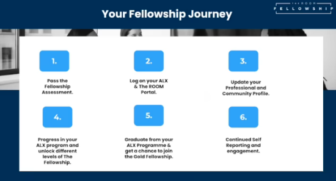
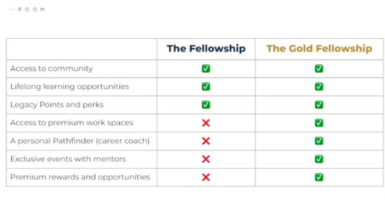
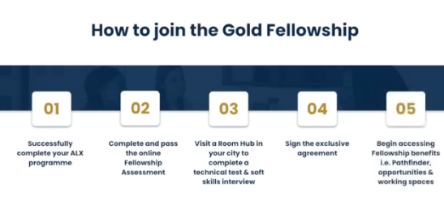
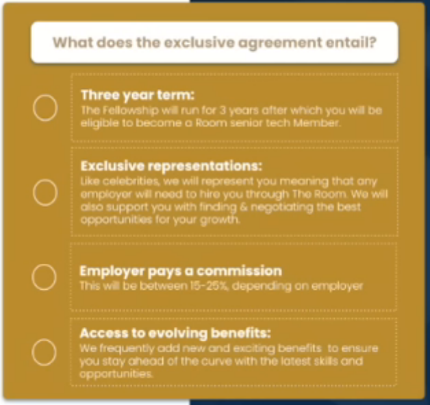

# Module 2.2 - The Room Fellowship

## Africa's greatest resource

Africa's greatest resource is its human resource, and most importantly, its youth.

They have the potential to unlocking the growth and development Africa needs.

## What is the average age on the African continent?

Having a young population is a tremendous opportunity to create waves of
change and transformation.

- The average of an African is **19**, vs 48 in Japan
- 40% of the world's population by the end of the century
- Largest workforce in 2035

## What is ALX's Moonshot goal?

To create 2M Jos by 2030.

Believes that the only way to do this is by **developing** the African people to take up opportunities and take initiatives. ALX does this by **Educating** and *connecting* the right people to great **Opportunities**

## What is The Room Fellowship?

**Partners** with the **world's** top young talent to accelerate their **careers** and their **impact**

It is very keen on **relationships**, NOT **transactions**. It believes on the long term impact of having a healthy network and connections.

[Read more about The ROOM](../Week1/1.3-intro-to-alx-n-the-room.md)

## What are 3 pillars of The Room Fellowship?

- **Career Support**

  Provides career support by giving you the opportunity to:
  1. Join **career growth workshops** that helps you to
     - tailor your resume to fit your goal
     - be better prepared for interviews
     - know how to position yourself for success.
  2. Get exposed to industry leaders and understand their mindsets by joining
  **Upskilling Masterclasses**
  3. Be a part of a **Community** of like-minded people.
     - Take deliberate actions with intentionality while being accountable and supportive of each other.
     - You support each other by positioning yourselves for growth in your career

- **Lifelong learning**
  - attained after successfully completing the Foundations programme
  - Access to masterclasses
    - soft skills and tech skills development
  - More tech specialization content to aid you in becoming better.

- **Perks**
  - end legacy points when you
    - participating in events
    - being active in your community and giving and receiving feedback
  - points can be traded for amazing gifts and souvenirs
  - access the ROOM Portal

## What is expected from you?

## 5 Keys to becoming a successful Fellow

1. Keep The ROOM up to date with your career progress
2. Show up and do what you say you're going to do
3. Perform on the job
4. Respect everyone
5. Take the lead on creating your own success

## The Gold Fellowship

**The aim of this Fellowship is help you catalyze a your career**
**growth and empower you to take on the world as one of Africa's top talent**

- Available only to the top 5 - 10% talent
- Eligible to join after successfully completing the program

Features

### Key Pillars to Gold Fellowship

- Infrastructure Support
  As a Gold Fellow you get exclusive access to stable internet and a working workstation that helps you to perform on the job and continue improving your skills.

  This is not available to Room Fellows after graduating from the program. This is an exclusive pick for the top talents.

  These spaces are available 24 hours.

- A Dedicated Pathfinder
  - collaborates on contract negotiation to secure the best possible deals for your career
  - represents you to top employers
  - works together with you to chart a course for your career path and receive guidance along the way.
- Lifelong learning
  - personalized career coaching and mentorship from industry experts
  - access to exclusive masterclass events to stay up-to date with tech trends
  - opportunities to grow, build your network, and stay ahead of the curve

- Premium Benefits With Legacy Points Gold
  You receive exclusive access to benefits only available in the Gold Fellowship.

### How to join the Gold Fellowship

### The Gold Fellowship exclusive agreement

