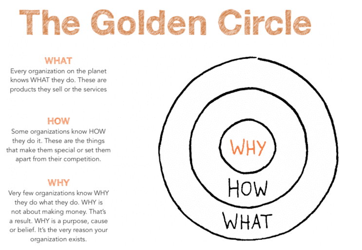
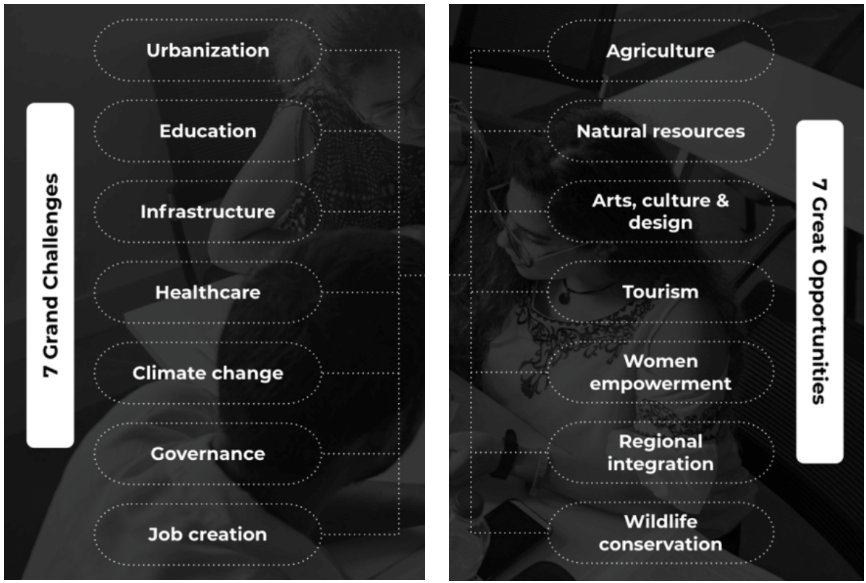

# Module 2.4 - Purpose: Part 1

People don't buy WHAT you do, they buy WHY you do it.

**WHAT** you do serves as the proof of what you believe **(Your WHY)**.

Starting with your **WHY** is how you *explain* your **purpose** and the *reason why you exist* and operate the way you do. Strategically presenting your WHY communicates directly with the **limbic brain** of your customers *(the listener)*. This has to do with their desires and needs, and the limbic brain does just that.

The **limbic brain** is closely connected to the neocortex, the part of the brain responsible for rational and analytical thinking. It is the part of the brain responsible for emotions, motivation, and behavior. It's also known as the *"emotional brain"* because it processes emotional information and plays a crucial role in decision-making.

By focusing on the "WHY", companies can create a more emotional connection with customers and inspire loyalty. It goes beyond just making profits, that's a result. They are NOT focused on the products or services themselves but on the purpose and belief system behind them.

Here are few examples successful companies' "WHY"

- Google: "To organize the world's information and make it universally accessible and useful"
- Apple: "To empower creative exploration and self-expression."
- Canonical (Creators of Ubuntu Linux): "To enable global collaboration to produce world-changing software."
- OpenAI (ChatGPT creators): "To ensure that artificial intelligence (AI) benefits humanity."

These are the **Mission Statements** of these companies, that is what drives them to do what they do. They are usually short and memorable.

## The Golden Circle

- The **"WHY"** circle represents a company's purpose or belief system, which should be the core of its communication strategy.
- The **"HOW"** circle represents the process or methodology a company uses to achieve its purpose.
- The **"WHAT"** circle represents the products or services a company offers.

Want to read more? Check it out [here](https://bit.ly/the-golden-circle-model "Golden Circle model: Simon Sinek’s theory of value proposition ‘start with why’")

## Grand Challenges, Great Opportunities

### Global Challenge: Urbanization

#### **How does Muggah describe the “two-sided nature” of cities?**

The Positive side of cities:

- Sources of economic growth and development
- Offers more job opportunities than rural cities can
- Access to quality education and health care.
- Homes to immigrants with diverse population

The Negative side of cities:

- High levels of crime and violence, with some neighborhoods experiencing higher rates of crime than others.
- Pollution and environmental degradation are often more severe in urban areas than in rural areas, posing health risks to residents.
- urbanization can lead to loss of cultural heritage and displacement of communities

#### **Why are cities at risk in the long-run?**

Here are the factors:

1. Climate change
   - sea-level change, flood, extreme weather events.
   - causes a significant damage to infrastructure
   - this can cause people to be displaced and homeless as a result.
2. Resource depletion
3. Population growth
   - *cities are magnets* for people seeking better life conditions
   - Rapid population growth can strain infrastructure and services
   - leads to overcrowding, congestion and environmental degradation.
   - there are more than **22 million** refugees in the world
4. Inequality
5. Pandemics and health crises

#### What are the most effective solutions to the issues plaguing cities?

The most effective solutions will involve collaboration between government, civil society, the private sector, and residents, in order to build more inclusive, resilient, and sustainable cities for all.

1. **Participatory Governance:** Develop and implement policies that prioritize equity, social inclusion, and community participation in decision-making.
2. **Sustainable urban planning:** Promote sustainable urban planning and design that prioritizes livability, walkability, and environmental sustainability.
3. **Violence prevention:** Address crime and violence through community-based initiatives, law enforcement, and policies that address root causes.
4. **Climate resilience:** Plan and invest in green infrastructure, flood management, and disaster preparedness.
5. **Social and affordable housing:** Enhance access to basic services such as housing, healthcare, education, and public transportation.
6. **Economic development:** Increase investment in infrastructure, including green spaces, public facilities, and transportation systems.
7. **Digital Innovation:** Leverage technology to enhance urban services and improve governance. This includes investment in
   - smart city technology,
   - open data platforms, and
   - digital tools for citizen engagement.

### Global Challenge: Tech x Urbanization - The City Brain project

- an innovative approach to urban management
- leverages AI and data analytics to tackle pressing urbanization challenges in China. The include
  - **Traffic management**
    - uses real time data to reroute traffic flows in order to reduce congestion.
    - sends signals that reroute vehicles based on real conditions.
  - **Public safety**
    - detects anomalies and alerts the right authorities or bodies to respond
    - helps to respond faster to emergencies, while keeping citizens safe.
  - **Smart city planning**
    - with data-driven insights, more informed decisions can be made on the solutions to provide with regards to transportation, settlements, etc.
- developed by the Alibaba Group and Hangzhou government, China.

## Global Opportunity: Regional Integration

Regional integration is the coming together of different countries to share their resources. The reason is to cater for the youth, it talks about **55 small economies**. This means developing and expanding both physical and virtual connectivity.

### How the World Bank is going to help

- Connectivity: Helping to build roads, energy distribution, etc.
- Trade: Connecting multiple markets
- Skills development: Training and equipping people with the skills needed.
- Managing diseases and pandemics
