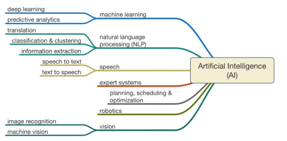

# Module 2.5 - Tech Foundations

## Artificial Intelligence (AI)

AI the simulation of human intelligence processes by machines, especially computer systems. It involves creating intelligent that can **analyze**, **learn from data**, and **make decisions** that *mimic* human cognitive abilities

It was first coined by John McCarthy and others in 1955 at the Dartmouth Conference

### The Pros of AI

Not an exhaustive list, but AI can:

- automate repetitive and time-consuming tasks **efficiently**
- process vast amounts of data with high precision **(exceptional accuracy)**
- use algorithms to analyze user data and provide personalized experiences
- brings about innovative advancements

### The Cons of AI

- Job displacement
- Lack of human judgement
- Dependence and reliability
- Can be biased if trained with biased data

### The Original 7 Aspects of A.I (in 1955)

1. Simulating higher function of human brain
2. Programming a computer to use general language
3. Arranging hypothetical neurons in a manner that they can form concepts
4. A way to t determine and measure problem complexity
5. Self-improvement
6. Abstraction: the quality of dealing with ideas rather than events
7. Randomness and Creativity

### Important components of Intelligence - John Copeland

- Generalization learning: enable learner to perform better in situations not previously known
- Reasoning: to draw an appropriate conclusion to the situation at hand
- Problem solving: ability to accept data and return accurate results
- Perception: Analyzing objects and the environment and making decisions, e.g. self-driving cars.
- Language understanding: ability to understand language like a human

### Examples of AI By Approach

- Machine Learning: An algorithm that allows to improve over time as it receives more data. It is programming of Input/Output not just coding.
- Robotics
- Computer Vision
- Pattern Recognition (e.g. Speech)
- Natural Language Processing (NLP)
- Knowledge Management

### Types of AI

- Strong AI: Can perform human tasks and sometimes even better than a human
- Weak AI: Behaves like a human but doesn't tell how the brain works. It achieves only what a human could achieve.

### Products from AI

- IBM's Watson
- Google's Deep Learning: uses nodes that act like artificial neurons

### Expert Systems

- A type of AI software
- Designed to mimic the problem-solving abilities of human in specific disciplines
- It's like having a virtual expert in a particular field teaching you what you are asking for.
- It asks the questions and analyzes your input to present an answer
- Most bots seen on websites that provide support can be termed as expert systems.
- They contain knowledge base information that enable them to answer questions. Example are FAQs about a certain software functionality, or answers to well-known user queries.
- Example of a bot that uses expert system is ALX's LEA bot.
- There are more bots that are use expert systems, here are few
  - Chatbots for Customer Support
    - ALX's LEA
    - [Amazon Customer Support Chatbot](https://www.amazon.com/gp/help/customer/contact-us/)
  - Technical Support Bots
  - Financial Planning Bots
    - [Wealthfront](https://support.wealthfront.com/hc/en-us/)
    - Betterment
  - Legal Advice Bots
    - [DoNotPay](https://donotpay.com/)
    - [LegalZoom](https://www.legalzoom.com/)
  - Virtual Health Assistant Bots
    - [Your.MD](https://www.livehealthily.com/)

## Why Learn Ethics in Technology?

Analyzing the pros and cons of applying technology in certain ways allows you to:

- **Identify areas of conflict:** allows you to employ potential solutions to ensure the solution is helpful rather than harmful.
- **Make informed decisions:** helps you to choose technologies that fit your culture.
- **Address societal challenges**
- **Promote ethical development and use of tech:** ensures accountability.

## Ethical Concerns with the use AI

- Privacy: the risk of [PIIs](https://www.techtarget.com/searchsecurity/definition/personally-identifiable-information-PII "Personal Identifiable Information") being misused or accessed inappropriately. Or worse, users being tracked without their knowledge.

- Work replacement vs work enhancement: AI-driven work submissions on the rise.
- Bias and discrimination: biased training data results in biased response and decisions. Example is the [COMPAS](https://en.wikipedia.org/wiki/COMPAS_(software) "Correctional Offender Management Profiling for Alternative Sanctions") System used in the American justice system

- Transparency and accountability
  - Example is the **Black Box problem in AI**, where the decision making process of a model is not transparent or explainable which makes it harder to correct the error or bias in the system.

- Safety and Security
  - The risk of it being hacked and fooled.
  - example is when researchers hacked into a Tesla model S autonomous vehicle and gained full control over its functionalities.
- Unemployment and inequality
