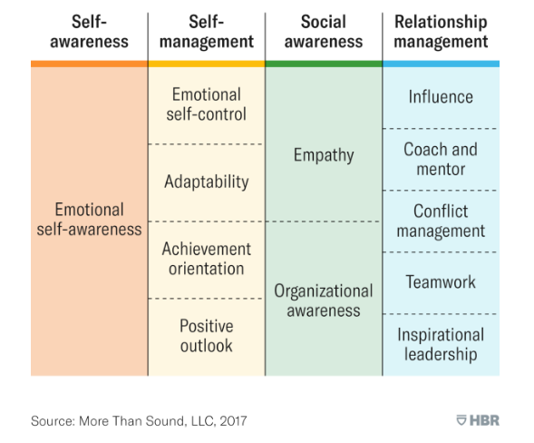
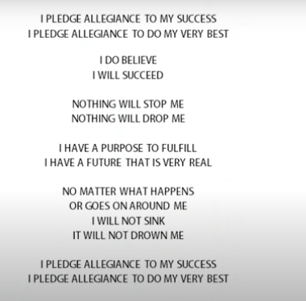

# Module 2.7 - Knowing Yourself

## Emotional Intelligence

 *"Truly effective leaders are also distinguished by a high degree of*
 *emotional intelligence" - Daniel Goleman*

Emotional intelligence (EI) is the ability to **recognize**, **understand**, **manage**, and **handle** emotions. It involves *blending* **thinking(logic)** and **feeling(emotion)** to make optimal decisions. Emotional intelligence involves being aware that emotions *drive* behaviors and impact people either positively or negatively.

It was originally developed in the 1990s

### The four aspects Emotional Intelligence

1. Ability to **perceive** emotions
   - Using facial expressions and gestures to recognize what someone might be feeling
2. **Understanding** emotions and associated patterns
3. Using emotions to **facilitate** thought
   - Emotions prioritize our thinking
4. **Managing** emotions
   - using your emotions to your advantage

### Emotional Intelligence - The Havard Breakdown

## The Need for Self-Awareness

*“The best leaders know themselves best and surround themselves with the rest.”*
*- Lori Stohs*

Self-awareness is defined as conscious knowledge of oneself; it’s a stepping stone to reinventing oneself, learning to make wiser decisions, and helps you tune into your thoughts and feelings. *Source: [Paul Jun's Article](http://99u.com/articles/30437/its-all-our-fault-self-awareness-as-a-secret-weapon-for-habit-change)*

A self-aware person knows what drives them and how to expand on them. They also know what triggers them and how to bring it under subjection. *(Self direction)*

Self-awareness is a life-long journey.

1. **Who am I?**: *Helps you understand where you are and your area of expansion*
   - Your beliefs and values
   - Your character
   - Your knowledge
   - Your Skill
   - Your talents
2. **What do I know?**
   - your area of specialization
   - experiences
3. **What can I do?**
   - things you can do easily
   - things you are good at

*“For a person who is not aware that he is doing anything wrong has*
*no desire to be put right. You have to catch yourself doing*
*it before you can reform.” - Seneca(Roman philosopher)*

## PICS

- **Passions**: What would you get out of bed for in the morning if money wasn’t an issue?
- **Interests**: What are you most curious about?
- **Causes**: What keeps you up at night?
- **Strengths**: What is your superhero power?

## Introduction to Personal Mission Statements

A passionate Organization is usually the **RESULT** a **Missioned** Organization.

A passionate individual is usually the **RESULT** a **Missioned** Individual.

A very declaration by David Andeson

