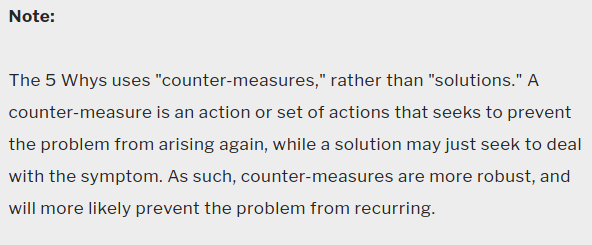

# Module 3.6 - Problem Definition

## Intro to Problem Solving

The cost of a bad decision may be dire. And if you do not have a clear understanding of the problem you are trying to solve, it's very unlikely to come up with a good decision. So, what then is a **problem?**

> **A problem is an unwanted situation that needs to be addressed or resolved in order to achieve the desired situation.**
>
> A problem can be regarded as a difference between the actual and desired situations.
>
> - knowing what the desired outcome (success) is will help guide your solutions.

### Defining the Problem

> Spend more time **defining** the problem than solving it

- State the problem in a broad manner
- Gather information and facts
  - the impact it has and the consequences encountered
- Assert if the problem is the reason preventing you from reaching your goals
- Do not confuse yourself with symptoms of the problem with the actual problem
- Do not confuse problems with opportunities.

### The 5 Whys Technique

> Use Lean’s “5 Times Why” method to find the root cause of the problem.
> Stubborn or recurrent problems are often symptoms of deeper issues. 1
>
> Sakichi Toyoda, the Japanese industrialist, inventor, and founder of Toyota Industries, developed the 5 Whys technique in the 1930s. It became popular in the 1970s, and Toyota still uses it to solve problems today. 1
>
> The method is remarkably simple: when a problem occurs, you drill down to its root cause by asking "Why?" five times. Then, when a counter-measure becomes apparent, you follow it through to prevent the issue from recurring.
>
> 
>
> *Source <https://www.mindtools.com/a3mi00v/5-whys>*

### When to use the 5 Whys and When NOT to

- ✅ troubleshooting
- ✅ quality improvement
- ✅ solving simple to moderately difficult problems
- ❌ not be suitable if you need to tackle a complex or critical problem.

### How to use the 5 Whys

- **Assemble a Team**
  - include people who are familiar with the specifics of the problem
  - there should a facilitator to keep the team focused on the problem discussed
- **Define the Problem**
- **Ask the First "Why?"**
  - record answers as succinct phrases, not lengthy statements or single words.
- **Ask "Why?" Four more times**
  - Each time, frame the question in response to the answer you've just recorded
  - Try to move quickly from one question to the next, so that you have the full picture before you jump to any conclusions.
- Know when to Stop
- Address the Root Causes
- Monitor you Measures
  - Keep a close watch on how effectively your counter-measures eliminate or minimize the initial problem.

### The 5 Ws (+H) Technique

<b>An approach used to better understand, define, and articulate a problem</b>

#### WHAT?

- **What** is the problem?
- **What** is reality like because of this problem?
- **What** will the reality be like if the problem continues?

#### WHO?

- **Who** does this problem impact, directly and indirectly?
  - This could include people and/or animals
- **Who** contributes to the problem?
  - e.g., specific corporations, governments, and/or individuals?

#### WHEN?

- **When** did the problem begin?
- **When** does the problem occur?
- **When** does it need to be resolved?

#### WHERE?

- **Where** is this problem occurring?
  - And **what** is the context in which it occurs?

#### WHY?

- **Why** is the problem happening?
- **Why** is it important to solve the problem?
  - highlight the pain

#### HOW?

- **How** would the world be different in the problem were solved?
- **How** do we solve the problem

## Writing a Problem Statement

### What is a Problem Statement?

A problem statement is a **concise and clear** description of a **specific** problem that **needs to be solved**, **its significance**, and **who** it affects. It **identifies** the gap between the <u>current state *(i.e., the problem)</u>* and <u>the desired state *(i.e., the goal).</u>*

An effective problem statement is designed to address the Five Ws (+H).

### Key elements of an effective problem statement include

- Succinct **problem description**
  - **a more concise 'what' and possibly 'when'**
- Indicate the specific **population** affected
  - **a more concise 'who' and 'where'**
- Explain the **impact** of the problem
  - cost, time, quality, environmental, personal, etc.
  - **a more concise 'why'**
- Explain what reality would look like if the problem were solved.
  - Identify the **gap** that exists between present reality and the desired outcome.
  - **a more precise 'how'**

## Sources

[1]: 5 Whys (<https://www.mindtools.com/a3mi00v/5-whys>)
