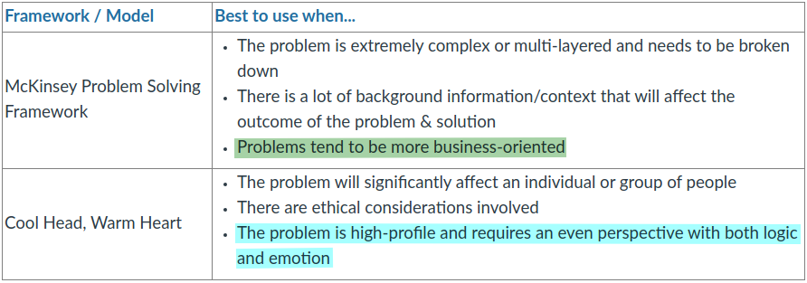

# Module 3.7 - Problem Solving Approaches

## Cool Head, Warm Heart

- a problem-solving approach that balances analytical and emotional considerations.
- It involves making decisions that align with one's values and goals while also considering the perspectives and feelings of others.
- often used in interpersonal and social contexts, such as leadership, communication, and conflict resolution.

### Cool Head

- > Having a *"cool head"* means thinking **logically** and making **decisions based on reason** and **evidence** *rather than emotion.*
- > A cool head is **essential** for making **sound judgments** and avoiding impulsive or irrational behaviour.

### Warm Heart

- > Having a "warm heart" means showing kindness, empathy, and compassion towards others.
- > It is essential for building strong relationships and creating a sense of community.

## McKinsey Problem Solving Framework

- often used in business and consulting settings
- particularly effective for **analyzing data** and **developing data-driven** and **evidence-based** solutions
- uses the **[5Ws](3.6-problem-definition.md#the-5-ws-h-technique)**

Requires answers to the following:

1. What is the problem?
2. Where and when does the problem occur?
3. Who is affected?
4. What will make a solution successful?
5. What are the boundaries of this problem?
6. Who or what can stop you from implementing the solution?

## When to use which Approach

Different problems often require a slightly modified approach, here is when to use one over the other

