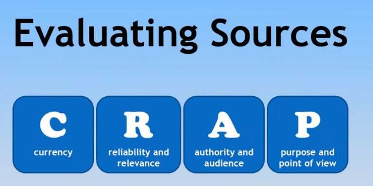

# Module 3.9 - Web Research 1

## Research Methodology

1. **Define your objectives, questions, and hypotheses.**
   - Clearly articulate the specific goals and purpose of your research.
   - Formulate specific research questions that will guide your investigation.
   - Develop hypotheses or tentative assumptions to test during your research.

2. **Determine your end outputs.**
   - Identify the types of data or information that will be most valuable for achieving your research objectives.
   - Consider the format or presentation style that will effectively convey your findings to your target audience.

3. **Scope your main sources of information.**
   - Identify potential sources such as academic journals, reputable websites, government publications, or industry reports.
   - Explore specific organizations or experts known for their expertise in the research area you are investigating.

4. **Begin gathering your required information.**
   - Determine relevant search terms or keywords to use in your research.
   - Decide on a reasonable number of reports or articles to review, considering the scope and depth of your research.

5. **Evaluate the validity/credibility of your sources and information.**
   - Assess the credibility and expertise of the sources you have gathered information from.
   - Look for consistency and corroboration of information across multiple reputable sources.
   - Identify any conflicting or outlier information and critically analyze its reliability.

6. **Synthesize and communicate your key findings.**
   - Summarize and integrate the most important findings from your research.
   - Consider visual aids, graphs, or charts to enhance the presentation of your key findings.
   - Tailor the communication of your findings to the intended audience, ensuring clarity and impact.

7. **Return to your original objectives and key questions to ensure you have answered them appropriately.**
   - Review your initial research objectives and research questions.
   - Evaluate whether your findings adequately address the objectives and provide the necessary direction for your work.

- Discuss with internal experts
- Internal Materials
- Government mandates

## Evaluating Sources

1. Currency:
   - Focus on current events, evolving technology, historical developments, or ongoing movements to ensure timeliness and relevance.
   - Stay updated on the latest information and trends to provide accurate and up-to-date content.

2. **Reliability and relevance:**
   - Assess whether the source provides the specific information you require for your research or inquiry.
   - Check for references or citations that support the information presented and verify the credibility of the sources.
   - Determine the original source of the information to ensure accuracy and credibility.
   - Be cautious of any potential biases that may influence the objectivity of the information.

3. **Authority and audience:**
   - Identify the author, institution, or organization responsible for creating and publishing the information.
   - Evaluate the credibility and expertise of the author or organization in the subject matter.
   - Consider the intended audience for the information and assess whether it aligns with your own research needs or target audience.

4. **Purpose and point of view:**
   - Determine the purpose behind publishing the information and understand the goal or intention of the author or organization.
   - Consider any potential biases or particular points of view presented in the information.
   - Analyze whether the information is intended to inform, persuade, promote, or present a specific viewpoint.

## Sources

- Evaluating Source, (<https://youtu.be/FKaH7PlXx1Q>)
