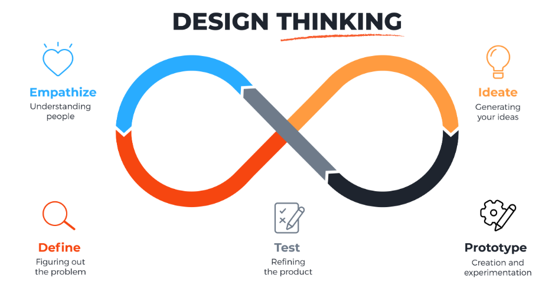

# Module 5.4 - Understanding the User

## Human Centered Design

- **What does it mean**
  - it is a creative approach to problem solving.^[What is Human Centered Design? (<https://youtu.be/musmgKEPY2o>)]
  - it **starts** with **people** and
  - **ends** with *innovative* solutions tailored *to meet their needs*
  - it is **how** you *think* and **what** you *do* with it
  - it's about designing **with** the end user, not just *for* them
- **Advantages**
  - your ideas will be embraced and appreciated by your users
  - cuts waste^[DevExplains: What is human-centered design (https://youtu.be/0bxtEqM2TQU)]
  - creates partnerships
  - checks assumptions
- **HCD processes**
  - Inspiration
    - learning on the fly
    - opening yourself to creative opportunities
    - requires a growth mindset
  - Ideation
    - come up with lots of ideas
    - build prototypes
    - iterate and keep testing till it's okay
  - Implementation
    - build relationships, partnerships
    - get your idea out there.

## The BUILD Framework

- **Believe**
  - Know that the problem you have identified has a solution, and
  - trust that you and your team can build something to address it
- **Understand**
  - learn about the experience of the people affected by this problem or who will be using your solution
  - what does their journey look like? What are their pain points?
  - What factors are affecting how they operate in or engage with the world?
- **Invent**
  - Create a **Minimum Viable Product** or prototype to test out an idea that you have!
  - Be sure to keep in mind how your "invention" will meet your users' needs.
- **Listen**
  - Get feedback from your users on your MVP or prototype and
  - modify it as needed.
- **Deliver**:
  - Continue to deliver refined versions of your MVP or prototype and
  - improve it over time!

## Design Thinking

- a methodology which provides a solution-based approach to problem solving
- very useful when used to tackle complex problems
  - usually *ill-defined* or *unknown*
- it focuses on understanding the needs of humans
- **non-linear** *but* **iterative**

### The 5 Stages of Design Thinking

- **Stage 1: Empathize**
  > The main aim of the Empathize stage is to develop the best possible understanding of your users, their needs and the problems that underlie the development of the product or service you want to create.
  - focus on **user-centric research**
  - it allows design-thinkers to set aside their **assumptions** and have an actual experience to gain insights
    - this allows them to understand their users better
  - consult experts in the field

- **Stage 2: Define - State Your Users' Needs and Problems**
  >  ...define the problem statement in a human-centered manner... not as your own wish or a need for the company
  - organize the information from Stage 1: Empathize.
  - *gathers* ideas to shape problem-solving elements for the design team.

- **Stage 3: Ideate**
  > ...you identify innovative solutions to the problem statement you’ve
created.
  - *collaboratively*, you and your team can explore various perspectives and generate innovative solutions for your stated problem.
  - **Brainstorm** and **Worst Possible Idea^[Worst Possible Idea (<https://www.interaction-design.org/literature/topics/worst-possible-idea>)]** are techniques used here
    > It's very **difficult** to actually have good ideas without feeling **judged**

- **Stage 4: Prototype - Start to Create Solutions**
  > ...you identify the best possible solution.
  - this is an experimental phase
  - the objective is to find the optimal solution for each of the problems identified in the initial three stages.
  - The implemented solutions are evaluated within the prototypes, and
    - based on user experiences, they are examined, accepted, improved, or rejected one by one.
  - helps the design team gain a clearer understanding of the product's limitations and challenges.

- **Stage 5: Test - Try Your Solutions Out**
  > ...you test solutions to derive a deep understanding of the product and its users.
  >
  > The ultimate goal is to get as deep an understanding of the product and its users as possible

## Getting to Know the User

- **Who the users are**
  - Who are they?
  - Who are they not?
- **User needs**
  - user needs **drive** product/service development.
- **User experience**
  - User-centric products/services drive positive user experiences,
  - boosts user satisfaction and loyalty.
- Competitive advantage: Understanding the user can give you a competitive advantage by developing a product or service that meets the user's needs better than other available options.
- Innovation Opportunities: By understanding the user's needs, you can identify areas for innovation and develop new products or services that meet those needs.
