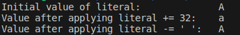
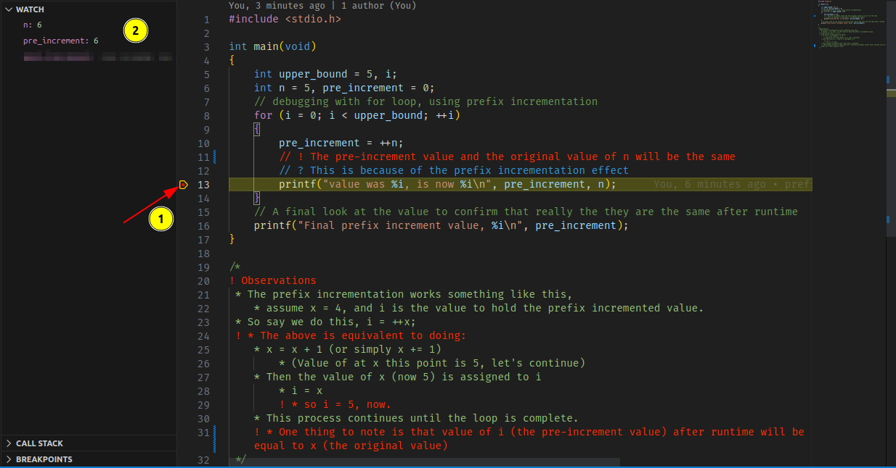
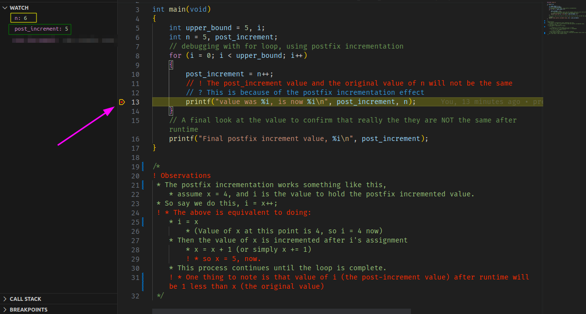
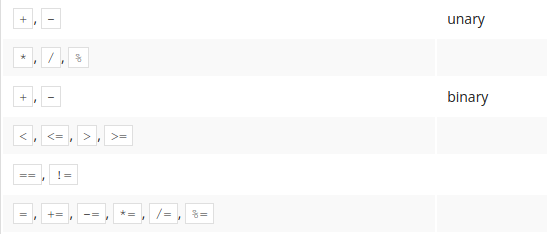

# Module 2 Notes - Basic Data Types, Operations and Flow Control

[Variables and data types](../../exercises/programming-in-c/variables-data-types.c)

## Data Types

### Floating-point numbers (float | double)

- Any number with a fractional part is considered a **float**
- **double** the size of a float(which is normally 4 bytes.)
  - this makes **double** 8 bytes (64 bits)
- All floating point constants are taken as a **double** by the C compiler
  - **floats** can be forced by appending `f` to the number. e.g. `3.14f`
- The format characters include `%e`, `f`, or `%g`
- `printf` always rounds floats and doulbes to **six decimal** place by default

### The Single Character Type (char)

- enclosed within a pair of single quotes. e.g. `'a'`, `'\n'`, `';'`
  - you can't have an empty char value. For example `char grade=''` is wrong.
  - **it must contain something**, even if it's a single space.
- uses the `%c` format specifier. e.g. `printf("%c", 'A');`
- corresponds to a unique number in the [ASCII code table](https://asciitable.com)
  - example `A` is **65**, `a` is **97**.
- some of the characters are simply **white space**
  - an example is the code use to mark the end of lines inside text files
    - ETX -> end of text
- accepts the **positive integer** version of the character you are trying to represent
  - for example, `char letter = 65;` is the same as `letter = 'A';`
  - as much as possible, use the actual character over the corresponding integer value.
  - accepted range is up to 255
  
    Why? Because it is easier to read, and you know it.
    Also it ensures that your program works on other system that does not use the ASCII
    mapping table. For example, the **EBCDIC** *(Extended Binary Code Decimal Interchange Code)*
- Here's how to code the single quote itself. `char literal = '\'';`
  - the character is escaped with the `\` character.
- What if you want to escape the escape character?
  - Turns out you'd have to *escape* it with itself. Here' how
    - `char literal = '\\'`.
    - the first `\` is the escape character, the second `\` gets
    assigned.
- Here's a few more escape characters

  | Character | Description | Info |
  |:---------:|:-----------:|:----:|
  | \n | Newline Character / Line Feed (LF) | Causes the next characters to be printed on a new line |
  | \r | Carriage Return (CR) | Returns to the beginning of the line |
  | \a | Alarm or Bell (BEL) | Causes a short beep when used |
  | \0 | NULL | Represents the end of line of text |

- The distance (space) between the lower and upper case letters is 32.
  - amazingly the *space* character in the ASCII table is also of integer number 32.
  - here's a cool way to use it. [code file](../randoms/char-arithmetic.c)

  ```c
  // declare the variable
  char literal; 
  // initialize it with a value
  literal = 'A';
  // using the space notion, set this literal to it's lower version
  literal += 32; // this causes it to become letter 'a'
  // now let's revert it to upper case.
  literal -= ' '; // see how this uses the space character? Yeah, it's value is 32.
  
  ```

  

### The Boolean Data Type (_Bool)

- represents a True(1) or False(0)
- adding the `<stdbool.h>` header file makes it easier to work with bools
- check [this file](../../exercises/programming-in-c/variables-data-types.c) for a sample use case of both scenarios

### Tpe Specifiers: long, long long, short, unsigned, short and signed

- Check this [code file](../randoms/sizeof.c) to examine the code for getting the size
of each data type.
- **long**
  - The long doubles the current space of a data type.
    - **long int -> 8 bytes**
    - **long double -> 16 bytes**
  - uses the formact specifier `%li`, `%lx`, `%lo`, `%ld`
  - e.g. `long int factotrial;`
  - There's no `long float`
    - Reason I believe it is the case is because, **double** handles that and there's
    no need to use the long for it. If a bigger space is needed for **floats**, **double** is
    used. In the same way, if the space provided by **double** (8 bytes) is not enough, then
    it can be further *doubled* with **long**, given it **16 bytes**.
- **short**
  - guarantees a space of no less than 2 bytes (16 bits)
  - uses the formact specifier `%hi`, `%hx`, `%ho`, `%hd`
- **unsigned**
  - used when the interger is to contain **only positive numbers**
  - gives the full space to the positive integers.
    - No need to worry about **integer overflow** errors that occur when using
    a **signed** data type.
    - Here's the caveat, using **negative** numbers raises the **integer overflow** error.
  - **int** has a 4 byte (32 bits) space, and all of this will be dedicative only to
  positive numbers.
  - e.g. `unsigned int age;`
  - allows you to omit the **int** keyword
    - e.g. `unsigned age;` works just as the `unsigned int age;`
  - takes care of figuring out the right data type.

### Notes of Scientific Notation Expressions

- Example: Speed of light of is 300,000,000m/s
  - This can be can expressed as (3 * 10^8).
  - *three times ten to the eigth power*
  - expressed in C as follows: `3E8`
- The **base value (mantissa)** can be an integer
  - the value before the `E` or `e`
  - can be a double or float
- The Exponent value **must** be in integer

### The Type Cast Operator

- Has the effect of converting one data to another, temporarily.
- a unary operator
- The conversion *change* is not permanent
  - it does not change the operand itself
- has precedence over arithmentic operators, except the plus(+) and minus(-)
unary operators
- Here is the format. *(data-type-to-case) constant|expression*
  - e.g. To convert **i** of type **int** to **float**, you do **(float) i;**
  - ⚠ be careful not to do this instead, **float(int)**
- [Example](../../exercises/programming-in-c/type-cast.c)

  ```c
      // integer values
      int score1 = 73, score2 = 46, score3 = 89;
      int num_of_scores = 3;

      // simple average computation
      //? (73 + 46 + 89) / 3 = 69
      int average = (score1 + score2 + score3) / num_of_scores;
      // print average
      printf("Integer Division Average: %d\n", average); // result is 69. Because decimal point is truncated

      // Another way would've been to store it in a float.
      //? (73 + 46 + 89) / 3 = 69.00. Only the result is stored as float
      float float_average = (score1 + score2 + score3) / num_of_scores; // integer division
      printf("Intger to Float Average: %.2f\n", float_average);         // result is 69.00. Still not quite right.

      // ! Expected result is 69.33(infinite)
      // using type casting.
      //? (73 + 46 + 89) / 3.0 = 69.33 -> the average is converted to a float before division
      float type_cast_average = (score1 + score2 + score3) / (float)num_of_scores;
      printf("Type Cast Average: %.2f\n", type_cast_average);
  ```

### The Assignment Operator

- right-to-left operator
- The value of the right-side operand is assigned to the operand on the left side.
  - the value of the right is stored in the container on the left. `a = 5;`
- 5 is stored in `a`, so anytime it is referenced, the value is returned

### The Arithmetic Assignment Operator

| Operator | Description | Example | Data types accepted |
|:--------|:----------:|:--------:|:---------:|
| += | Addition Assignment Operator |a = a + b; => a += b; | int, float, double, char, etc. |
| -= | Subtraction Assignment Operator | a = a - b; => a -= b; | nt, float, double, char, etc. |
| *= | Multiplication Assignment Operator | a = a * b; => a *= b; | int float, double |
| /= | Division Assignment Operator | a = a / b; => a /= b; | int, float, double |
| %= | Modulus Assignment Operator | a = a % b; => a %= b; | Requires integral values |

- Check out this [file](../../exercises/sams-24-hours-of-c/arithmetic.c)
for some implementations of the arithmetic assignment operators.

### The Relational Operators

- Has the least precedence amongst all other arithmetic operators.
- All arithmetics on both left or right are evaluated before a relational operation
occur.
  - Of course, you could parentheses to override this default
- Produces a result of either 0 (false) or 1 (true)

| Operator | Description | Note|
|:---------:|:-------:|:-------:|
| == | Equal to | Low precedence |
| != | Not equal to | Low precendence |
| > | Greater than | Has higher precedence over == and != |
| < | Less than | Has higher precedence over == and != |
| >= | Greater than or equal to | Has higher precedence over == and != |
| <= | Less than or equal to | Has higher precedence over == and != |

```c
// checking whether 10 is greater than 5.
printf("%d\n", 10 > 5); // result is 1(true) because 10 is in fact, greater than 5.

// Another example, this will be false(0)
printf("%d\n", 5 > 10); // 5 is not greater than 5.

// checking equality
printf("%d\n", 10 == 10); // similar to asking if 10 is equal to 10. Of course.

// checking inequality
printf("%d\n", 10 != 5); // indeed, 10 and 5 are not the same.
```

```c
// here's a quick ternary operation to check which number is greater
int a = 10, b = 5;
(a > b) ? printf("Yes, %i is greater\n", a) : printf("No, %i is greater\n", b);

// The above code should display, "Yes, 10 is greater". The reason is quite obvious.
```

- Want to see more examples? Check [here](../../exercises/sams-24-hours-of-c/arithmetic.c)

### The Postfix and prefix incrementation/decrementation Operators

- Has precedence over other operators, except - and + unary operators.
  - it's a unary operator itself.
- Prefix Effect
  - Increment/decrement the variable by one and return its value already increased/reduced.
  - **pre- because the variable is modified first and then its value is used**
  - Examples: `--a`, `++a`
  - Check this [Prefix Incrementation Debugging code file](../randoms/prefix_effect_debug.c).Use the debugging feature to help you step through the code so you could examine the behavior.
  
- Postfix Effect
  - **Return the original (unchanged) variable's value** and then increment/decrement the variable by one.
  - **post- because the variable's value is used and then modified.**
  - Examples: `a--`, `a++`
  - Check this [Postfix Incrementation Debugging code file](../randoms/postfix_effect_debug.c).
  Use the debugging feature to help you step through the code so you could examine the behavior.
  

### Operator Priority

Below is the order of precedence for the operators, from highest to lowest

